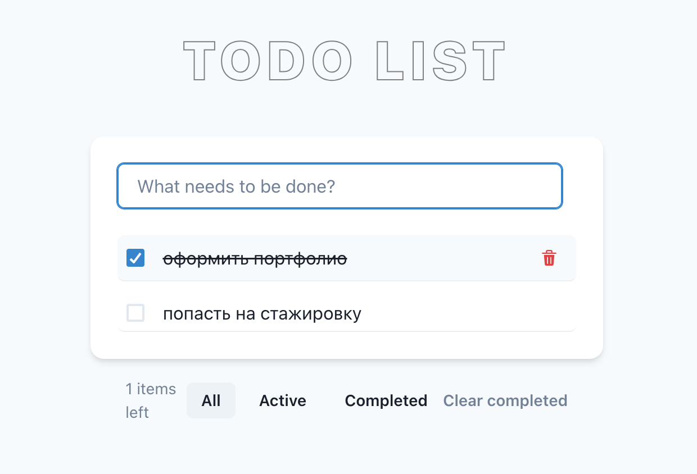

# React Todo App

Простое Todo-приложение на **React**, **TypeScript** и **Vite** с фильтрацией задач и возможностью удалять выполненные.

## Скриншот


## Старт проекта

```bash
git clone <твой-репозиторий>
cd <папка-проекта>
```
Установка зависимостей и запуск приложения:

```bash
npm i && npm run start
```
Откроется локально на http://localhost:5173

Сборка проекта для продакшена:
```bash
npm run build
```

Предпросмотр сборки:
```bash
npm run preview
```

## Функционал
- Добавление новых задач
- Чек-бокс для отметки выполненных задач
- Удаление задач
- Фильтрация: все / активные / выполненные
- Очистка всех выполненных задач

## Технологии
- React 18
- TypeScript
- Vite
- Chakra UI (компоненты и стили)
- Vitest + React Testing Library (тестирование)


## Тестирование
Запуск тестов:
```bash
npm test
```

Запуск тестов с анализом покрытия:
```bash
 npx vitest run --coverage
```